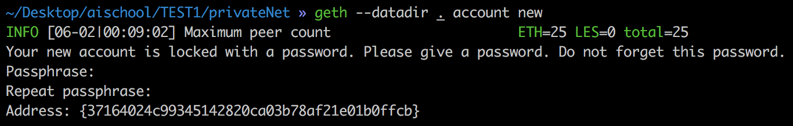
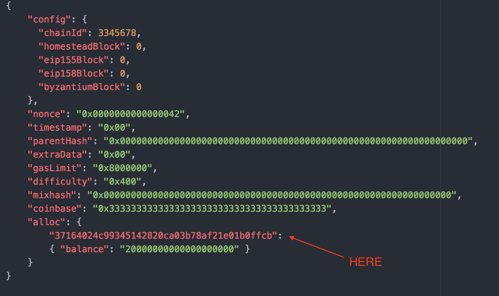
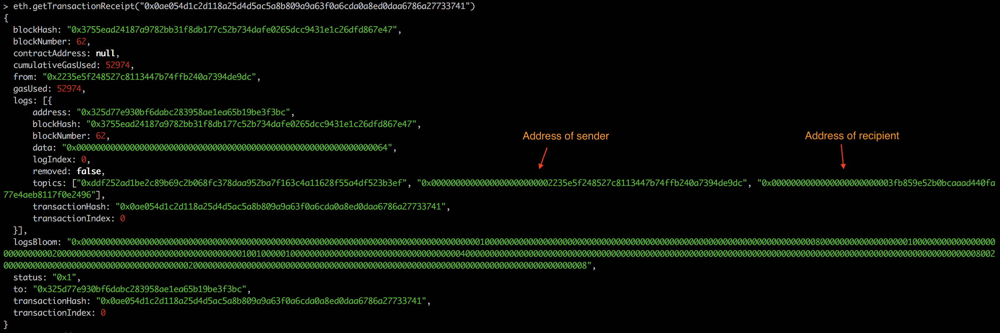
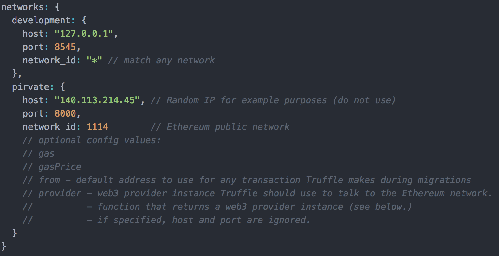

# Private Ethereum Network

## setup with geth via CLI

* Step 1: Install `geth`
    - For Ubuntu:
    ```
    $ sudo apt-get install software-properties-common
    $ sudo add-apt-repository -y ppa:ethereum/ethereum
    $ sudo apt-get update
    $ sudo apt-get install ethereum
    ```
    - For Mac:
    ```
    $ brew tap ethereum/ethereum
    $ brew install ethereum
    ```
    - create new account under the datadir
    ```
    $ mkdir privateNet && cd privateNet
    $ geth --datadir . account new
    ```

    - You will see something like this
    

      you can allocate some ETH to this address in `genesis.json` file

* Step 2: Initialize the private blockchain with the genesis block
    - Create genesis block file (`genesis.json`)
    

    - Config:
        - **chainId**: this is your chain identifier, and it is used in replay protection
        - **homesteadBlock, eip155Block, eip158Block, byzantiumBlock**: these relates to chain forking and versioning, so in our case lets leave them 0 since we're starting a new blockchain
        - **difficulty**: This dictates how difficlt it is to mine a block. Seeting this value low (~10-10000) is helpful in a private blockchain as it lets you mine blocks quickly, which equals fast transactions, and plenty of ETH to test with. (ps: Ethereum Mainnet Genesis file defines a difficulty of 17179869184)
        - **gasLimit**: This is the total amount of gas that can be used in each block. With such a low mining difficulty, blocks will be moving pretty quick, but you should still set this value pretty high to avoid hitting limit and slowing down your network
        - **alloc**: You can allocate ETH to specific addresses in the beginning. This won't create the account for you, so make sure its an account you already have control of. You will need to add the account to your private chain in order to use it. And to do that you need access to the keystore/utc file. For example, Geth and MyEtherWallet give you access to this file when you create an account, but Metamask and Coinbase do not. The addresses provided are
        not real addresses, they are just examples.
        - **coinbase**:

    - Instantiate genesis block
    ```
    $ geth --datadir . init ./genesis.json
    ```

* Step 3: Start a Ethereum node with `geth`
    ```
    $ geth --identity "node1" --rpc --rpcport 8000 --rpccorsdomain "*" \
    --datadir . --port 30303 --nodiscover --maxpeers 25 \
    --rpcapi "eth,net,web3,admin,db,debug,miner,shh,txpool,personal" \
    --networkid 1114 console 2>> geth.log
    ```

    `Geth` command line options:

    * `--nodiscover` ：關閉節點的可發現性，可以防止使用了相同network id和創世塊的節點連接到你的區塊鏈網絡中（只能通過手動來添加節點）
    * `--maxpeers 0` ：指定網絡中的最多節點數
    * `--rpc` ：啟用RPC服務
    * `--rpcapi` "db,eth,net,web3" ：指定啟用的RPC API
    * `--rpcport "8080"` ：指定RPC的端口
    * `--rpccorsdomain` ：指定哪些URL可以連接到你的節點
    * `--datadir` ：以太坊區塊鏈的數據目錄
    * `--port` ：連接到其它節點的網絡監聽端口
    * `--identity "FirstNode"` ：指定節點名稱
    * `console` ：啟動geth控制枱進程
    * `--rpccorsdomain "value"`  Comma separated list of domains from which to accept cross origin requests (browser enforced)

    * `--rpcapi "eth,net,web3"` is required for geth attach to work (we’ll use this shortly)

    * `--rpcapi "eth,net,web3"` is required for web3 to work in truffle

    * `--rpcport 8545` is to be consistent with ethereumjs-testrpc, and make integration with truffle easier

    Read more about the geth command line options **[here](https://github.com/ethereum/go-ethereum/wiki/Command-Line-Options)**

    After starting the geth node you should see something like **IPC endpoint opened**: ``/home/someone/privateNet/geth.ipc`


* Step 5 - Working with geth console
    -  We can attach to the geth console by using `geth.ipc`
    ```
    $ geth attach ipc://home/someone/privchain/geth.ipc
    ```
    - Create account
    ```
    > personal.newAccount("<your_passphrase>")
    ```

    - Set default account
    ```
    > miner.setEtherbase(web3.eth.accounts[0])
    ```

    - Mining  (the mined ETH will go to defaul account)
    ```
    > miner.start()
    > miner.stop()
    ```

    - Check balance
    ```
    > eth.getBalance(eth.coinbase)
    ```


## Add other peers  

1. Start another peer

    On your same machine instantiate a new datadir: (`genesis.json` must be same as 1st node)
    ```
    $ mkdir node2 && cd node2
    $ geth --datadir . init genesis.json
    ```

2. Launch the 2nd peer on a different port
    ```
    $ geth --identity "node2" --datadir . --port 30304 --networkid 1114 console 2>> geth.log
    ```

3. Join 1st node
    ```
    # Get "enode" infomation of 1st node
    > admin.nodeInfo.enode

    # In 2nd node, replace [::] with peer node ip
    > admin.addPeer("enode://b785a355234033aa6b32a01607ba6afbf96f4446119b5581beb075a9695afb1db9a0d5160e8c16d951eb5834f188b2826e3e7d44f3eaa7c6974962c40b2680fc@[::]:30303?discport=0”)

    # Verify your nodes are now communicating
    > admin.peers
    ```

## Deploy a contract to our private network

1. Install solidity compiler: `solc`
    ```
    $ npm install -g solc
    ```
    For ubuntu
    ```
    $ sudo apt-get install software-properties-common
    $ sudo add-apt-repository -y ppa:ethereum/ethereum
    $ sudo apt-get update
    $ sudo apt-get install ethereum solc
    ```

2.  Compile your contract and get contract **bytecode** and **abi**
    ```
    $ solc contract.sol --bin --abi
    ```

    In `geth console`: (note: you have to add **"0x"** in fornt of code to indicate the string type)
    ```
    > var bytecode = "0x<contract_bytecode>"
    > var abi = <contract_abi>

    # Unlock an account before deploying new contract
    > personal.unlockAccount(eth.coinbase)

    > var contract = eth.contract(abi).new(<constructor arguments value>, {from: eth.coinbase, data: bytecode, gas: 2000000})

    # see the transaction hash
    > instance.transactionHash

    # see the transaction detail
    > eth.getTransaction(contract.transactionHash)
    ```

4. Mine the transaction
    Unlock an account
    ```
    > personal.unlockAccount(eth.coinbase)
    ```
    Mine a block
    ```
    > miner.start(); admin.sleepBlocks(1); miner.stop();
    ```

## See the transaction result

```
> web3.eth.getTransactionReceipt(instance.transactionHash)
```

You can see the example result:


Returns：
`Promise` returns `Object` - A transaction receipt object, or null when no receipt was found:

* `status` if the transaction was susccessfull, FALSE, if the EVM reverted the transaction.
* `blockHash`
* `blockNumber`
* `transactionHash`:
* `from`: String - 20 Bytes, Address of the sender.
* `to`: String - 20 Bytes, Address of the receiver. null when its a contract creation transaction.
* `cumulativeGasUsed`: Number - The total amount of gas used when this transaction was executed in the block.
* `gasUsed`: Number - The amount of gas used by this specific transaction alone.
* `contractAddress`: String - 20 Bytes, The contract address created, if the transaction was a contract creation, otherwise null.
* `logs`: Array of log objects, which this transaction generated.
    如果有event被觸發，資料就會被入在這

    那什麼時候會需要用到event呢？
    1. 當作一個額外的儲存空間，而且很便宜。event寫入的成本和用合約變數來儲存的成本相比之下少了很多，如果你開發的dapp需要將使用者的使用紀錄(如付款紀錄)等記錄下來當作證明，與其用一個陣列儲存，不如在每次使用時用event寫進log裡。但要注意的是，這些寫進log裡的資料是沒辦法被合約所存取的。


## Check the balance of all accounts   

```js
> function checkAllBalances() {
    var totalBal = 0;
    for (var acctNum in eth.accounts) {
        var acct = eth.accounts[acctNum];
        var acctBal = web3.fromWei(eth.getBalance(acct), "ether");
        totalBal += parseFloat(acctBal);
        console.log("  eth.accounts[" + acctNum + "]: \t" + acct + " \tbalance: " + acctBal + " ether");
    }
    console.log("  Total balance: " + totalBal + " ether");
};
```
```
> checkAllBalances();
```


## Connect to Private Network with `truffle`

Modify the `truffle.js` file:



For each network, if unspecified, transaction options will default to the following values:

**`gas`**: Gas limit used for deploys. Default is 4712388.

**`gasPrice`**: Gas price used for deploys. Default is 100000000000 (100 Shannon).

**`from`**: From address used during migrations. Defaults to the first available account provided by your Ethereum client.

**`provider`**: Default web3 provider using host and port options: new Web3.providers.HttpProvider("http://<host>:<port>")


Then, specifying a network during migration
```
$ truffle migrate --network pirvate
```

### COMPILING CONTRACTS
- Location:
    - All of your contracts are located in your project's `contracts/` directory. As contracts are written in Solidity, all files containing contracts will have a file extension of `.sol`. Associated Solidity libraries will also have a `.sol` extension.

    - With a bare Truffle project (created through `truffle init`), you're given a single `Migrations.sol` file that helps in the deployment process.

- Compile
```
$ truffle compile
```
Upon first run, all contracts will be compiled. Upon subsequent runs, Truffle will compile only the contracts that have been changed since the last compile. If you'd like to override this behavior, run the above command with the `--all` option.


### BUILD ARTIFACTS
Aftering compiling contracts, the build artifacts are stored in the `./build/contracts` directory as `.json` files. When you compile your contracts or run your migrations using a specific network, Truffle will update those `.json` files so they contain the information related to that network. When those artifacts are used later – such as within your frontend or application via truffle-contract – they'll automatically detect which network the Ethereum client is connected to and use the correct contract artifacts accordingly.


### To be continue ...
